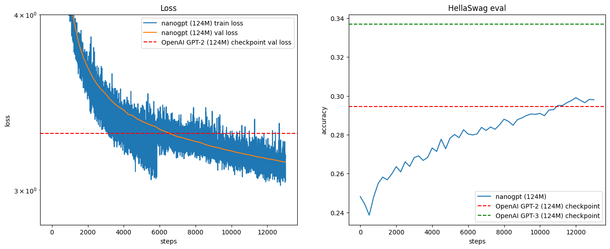

# Reproducing GPT2 (124M)

I had success with smaller training runs on my personal computer. However, I would strongly recommend using a LambdaLabs instance.

Personal Computer RTX 3080 (10GB) -  batch size 4, sequence length 1024.

LambdaLabs Instance 8x A100 (80 GB SXM4) - batch size 64, sequence length 1024.

I stopped training at approximately 13,000 steps, since GPUs cost money. By 13,000 steps the training and validation loss surpasses GPT2's validation loss and HellaSwag eval score.

### Create an account or login to Lambda Labs

Select "Instances" on the left toolbar.

Launch an instance.

Select 8x A100 (80 GB SXM4) or 8x H100 (80 GB SXM5).

Either of these will allow you utilize Distributed Data Parallel (DDP).

